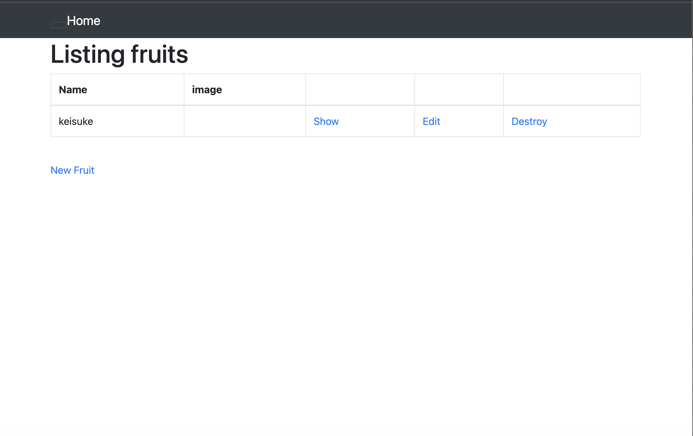
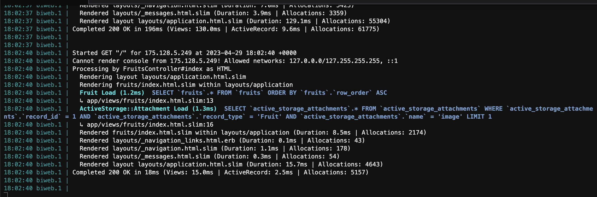

## 第３回AWS講義課題

### APサーバーの名前とバージョンを確認してみましょう。
APサーバーの名前：puma

APサーバーのバージョン：5.6.5

### APサーバーを終了させた場合、引き続きアクセスできますか？結果を確認して、また APサーバーを起動してください。
終了させた場合：アクセスできない

再び起動させた場合：アクセスできる

### DBサーバー（DBエンジン）の名前と、今 Cloud9で動作しているバージョンはいくつか確認してみましょう。
DBサーバーの名前：mysql

DBサーバーのバージョン：8.0.33

### DBサーバーを終了させた場合、引き続きアクセスできますか？
終了させた場合：アクセスできない

### Rails の構成管理ツールの名前は何でしたか？確認してみてください。
Bundler

### 今回の課題で学んだこと

サンプルアプリケーション起動確認スクショ

今回の課題でAPサーバーやDBサーバーについて学んだが、

まだちゃんと理解できていないので、今後また理解を深めていきたい。

mysqlのコマンドまとめ

起動:  sudo service mysqld start

状態確認:  sudo service mysqld status

停止: sudo service mysqld stop

再起動: sudo service mysqld restart

