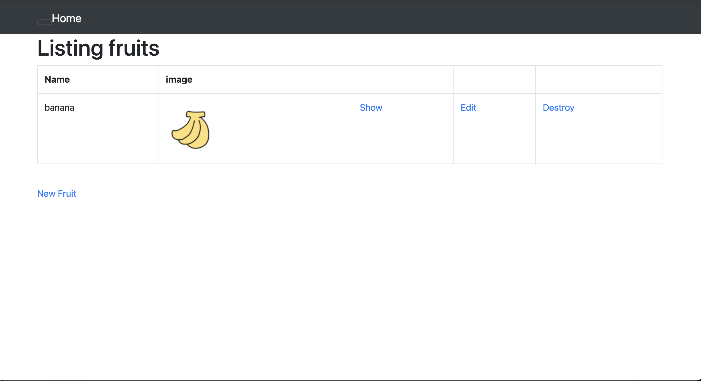
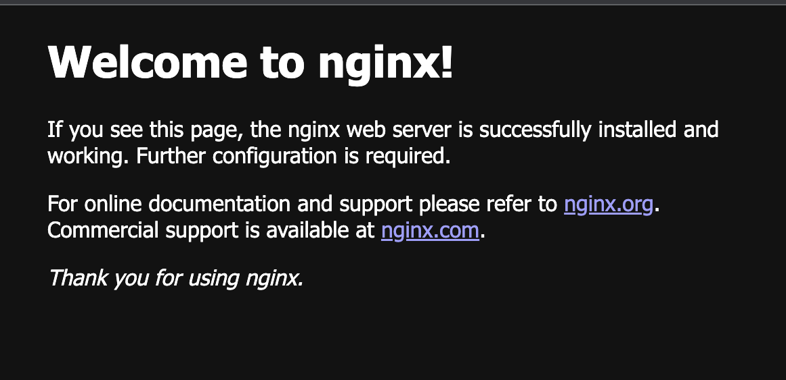
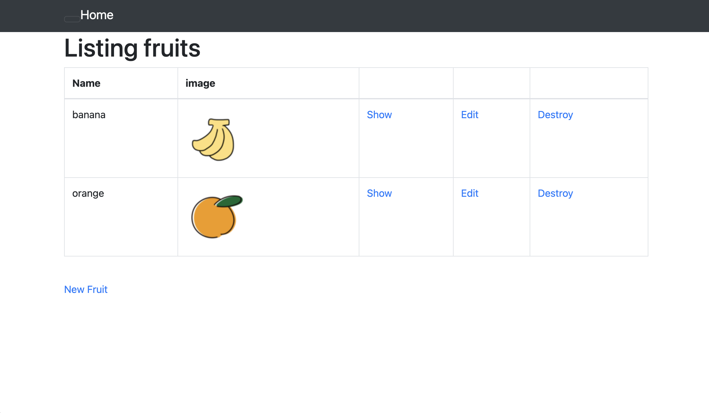
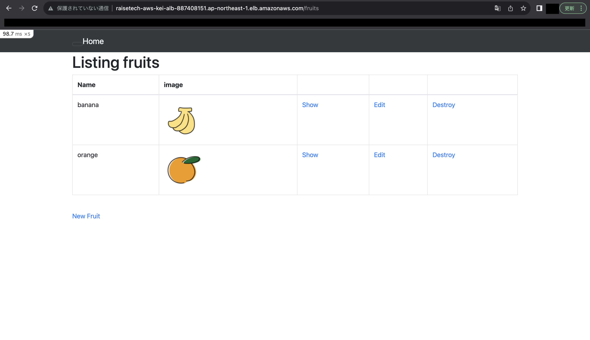
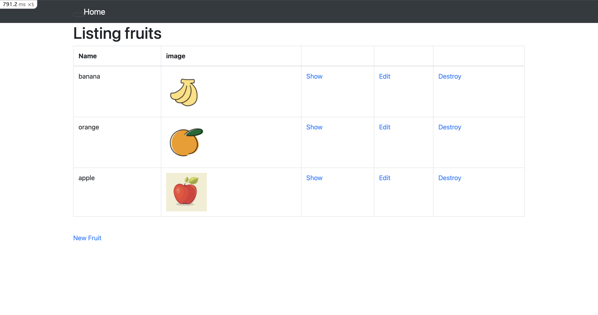
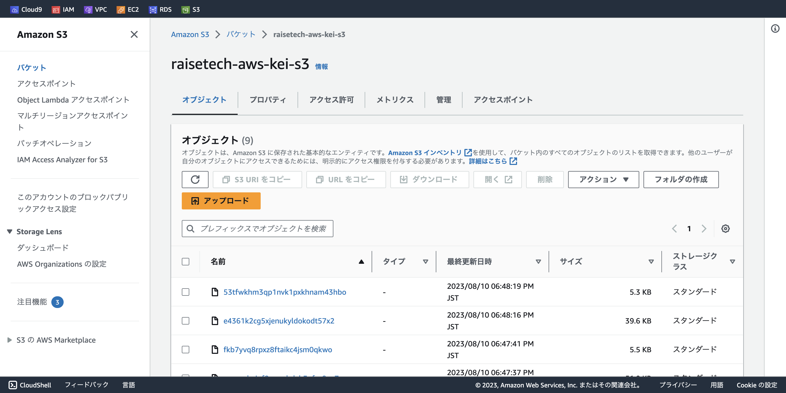
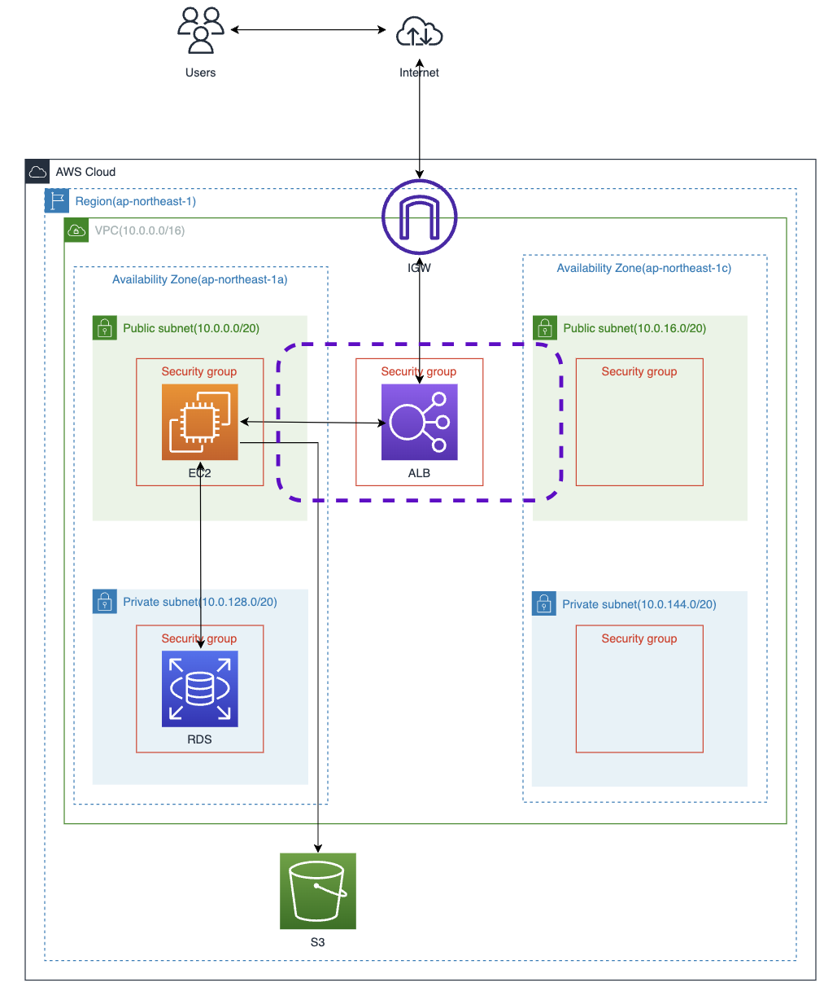

## AWS第5回講義課題

### lecture05の主な流れ

start

[デプロイ参考資料](https://pikawaka.com/rails/ec2_deploy)

EC2上に第３回のサンプルアプリケーションをデプロイさせる

↓

●組み込みサーバー(Puma)で起動させる(デプロイ)

↓ 

●Webサーバー(Nginx)、AP サーバー(Unicorn)と個別にサーバーを立てて起動する(デプロイ)

↓

●デプロイ出来たらELB (ALB)を追加して確認する

↓

●S3を追加する(使い方はお任せとのこと)

↓

●ここまでの環境の構成図を作成する

end

### 組み込みサーバーでデプロイ

※ターミナルからEC2に繋げる場合は、キーペアのファイルに移動して接続する

`sudo yum update`：ヤムのアップデート

`sudo yum -y install gcc-c++ make patch git curl zlib-devel openssl-devel ImageMagick-devel readline-devel libcurl-devel libffi-devel libicu-devel libxml2-devel libxslt-devel`：Railsアプリを動かす為に必要なパッケージのインストール

`curl -sL https://rpm.nodesource.com/setup_14.x | sudo bash -`：JavaScriptを実行できる環境に整える(リポジトリに追加する)

`sudo yum -y install nodejs`：Node.jsのインストール

`curl -sL https://dl.yarnpkg.com/rpm/yarn.repo | sudo tee /etc/yum.repos.d/yarn.repo`：yarnをインストールするための環境に整える(リポジトリに追加する)

`sudo yum -y install yarn`　：　yarnのインストール

`git clone https://github.com/sstephenson/rbenv.git ~/.rbenv`：rubyのバージョン管理ツールであるrbenvをインストール

`echo 'export PATH="$HOME/.rbenv/bin:$PATH"' >> ~/.bash_profile`：.bash_profileの設定

`echo 'eval "$(rbenv init -)"' >> ~/.bash_profile`：.bash_profileの設定

`source .bash_profile`：.bash_profileの設定

`git clone https://github.com/sstephenson/ruby-build.git ~/.rbenv/plugins/ruby-build`：rubyをインストールするためのruby-buildをインストール

`rbenv install 3.1.2`：ruby3.1.2のインストール(時間がかかる)

`rbenv rehash`：インストールしたrubyを使用可能にする

`rbenv global 3.1.2`：このインスタンスで使用するバージョンの設定　

`ruby -v`：インストールしたバージョンの確認

`git clone https://github.com/yuta-ushijima/raisetech-live8-sample-app.git`：サンプルアプリケーションをgit clone

`gem install bundler -v 2.3.14`：bundleをアップデート

↓ bundle installでエラーが出るからChatGPTに聞いた

`sudo yum install -y gcc-c++ patch readline readool bison curl sqlite-devel`：必要なライブラリやヘッダをインストール

`export PATH="/path/to/mysql/bin:$PATH”`：パスを通す

`sudo yum install -y mysql-devel`：mysql2 gem のインストールに必要なライブラリやヘッダをインストール

↓

`bundle install`：bundleをインストール

`cp config/database.yml.sample config/database.yml`：コピーしてそのデータのパスワード部分の空欄にmysql (RDS)のパスワードを入力する

`host: 〈RDSエンドポイント〉`：`database.yml`の中に`host:`追加する

`mysql_config --socket`：socketの場所を確認して、database.ymlのsocketの場所を変更する

`gem uninstall mysql2`：mysql2をアンインストール

`gem install mysql2`：mysql2をインストール

`sudo yum install mysql-devel`：mysql-develをインストール

`bundle install`：再びbundle install

`bin/setup`

`bin/dev`：ここでEC2との接続が切れる※結局このコマンドは使っていない

`bundle exec rails server`：bundle経由のrailsサーバー本来の起動コマンド

`bin/rails server -p 3000 -b 0.0.0.0`：このコマンドを

↓ 挿入したデータのせいでエラーが起きていたのでmysql(RDS)内のデータを削除した

`show databases;`

`use raisetech_aws_kei_database_1;`

`SHOW TABLES;`

`DELETE FROM active_storage_attachments WHERE record_id IN (SELECT id FROM fruits);`

組み込みサーバーでのデプロイ完了

### WebサーバーとAP サーバー分けてサーバーを立ててデプロイ

`sudo yum install http://nginx.org/packages/centos/7/noarch/RPMS/nginx-release-centos-7-0.el7.ngx.noarch.rpm -y`：Nginxのリポジトリをインストール

`sudo yum install nginx -y`：NginxのリポジトリをインストールしてからNginxをインストール

`sudo amazon-linux-extras install nginx1`：Nginxインストールコマンド

`sudo systemctl start nginx`：Nginx起動

`sudo systemctl status nginx`：Nginx起動確認

`sudo systemctl stop nginx`：Nginx停止

`curl -4 [icanhazip.com](http://icanhazip.com/)`：IPアドレスを見つけるコマンド

`ps ax | grep nginx`：nginxプロセスの存在を確認する

`ss -natu | grep LISTEN`：pootの確認

`sudo tail /var/log/nginx/error.log`：エラーログの確認

`sudo tail /var/log/nginx/access.log`：アクセスログの確認

`curl -I [http://localhost:](http://localhost:3000/)80`：Nginxがアクセス出来ているか確認

`bundle exec unicorn_rails -c config/unicorn.rb -E development -D`：unicorn起動

`ps -ef | grep unicorn | grep -v grep`：unicorn起動確認

`kill -9 <pid(unicorn.pidに記載されてる)>`：unicorn停止

`curl --unix-socket /home/ec2-user/raisetech-live8-sample-app/tmp/sockets/unicorn.sock http://localhost/`：Unicornがアクセス出来ているか確認

※curlコマンドを使えばソケット通信してアクセス出来ているか確認することができる

`rails assets:precompile`：

“config/environments/development.rb”ファイルの”`# config.assets.debug = true`"することでjavascrpt

### デプロイ出来たらELB (ALB)を追加して確認する

ロードバランシングのマネージメントコンソールで設定する

ターゲットグループのステータスがunhealthyになっていたが、ヘルスチェックのパスを/(スラッシュ)だけにするとhealthyになってヘルスチェックが合格した

### S3を追加する(使い方はお任せとのこと)

AmazonS3のマネージメントコンソールでバケットを作成

IAMユーザーの作成してS3Fullaccessのポリシーを許可

アクセスキーとシークレットアクセスキーを作成

config/environments/development.rbの設定変更

`service: S3
 access_key_id: アクセスキー
 secret_access_key: シークレットキー
 region: ap-northeast-1
 bucket: S3で作ったバケット名`

config/storage.ymlの設定変更（localからamazonに変更）

`config.active_storage.service = :amazon`

画像をアップロードしたらS3のバケット内に画像データが入った

S3のマネージメントコンソール内で画像データを削除したらweb上の画像も表示されなくなった

### ここまでの環境の構成図を作成する

draw.ioで構成図を作成

以上
