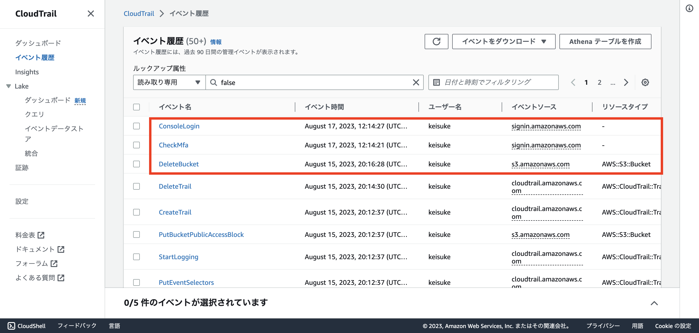
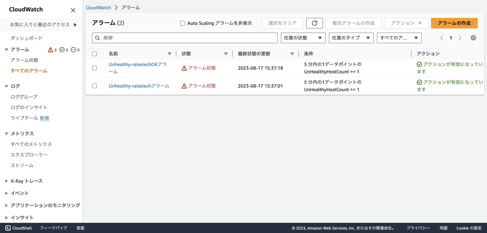
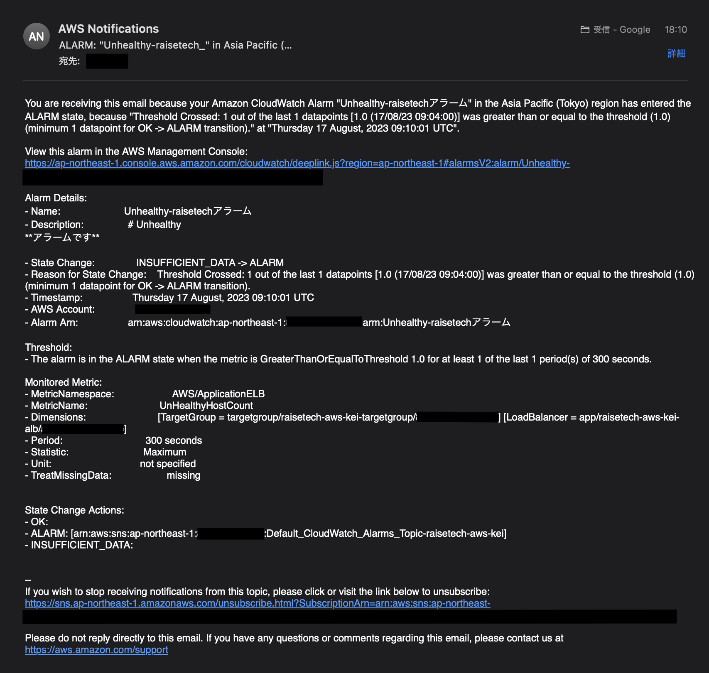
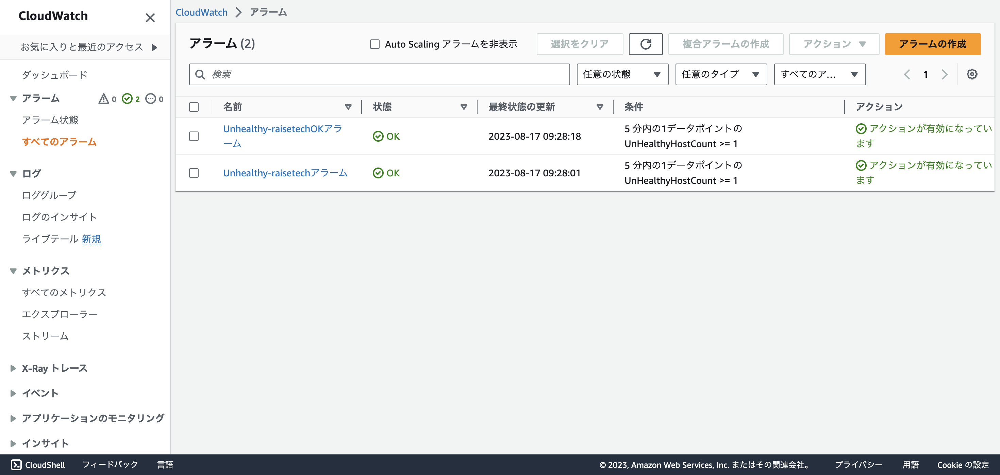
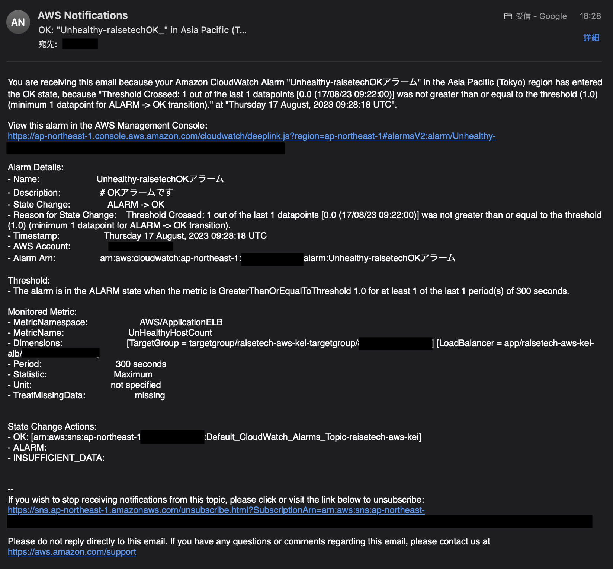
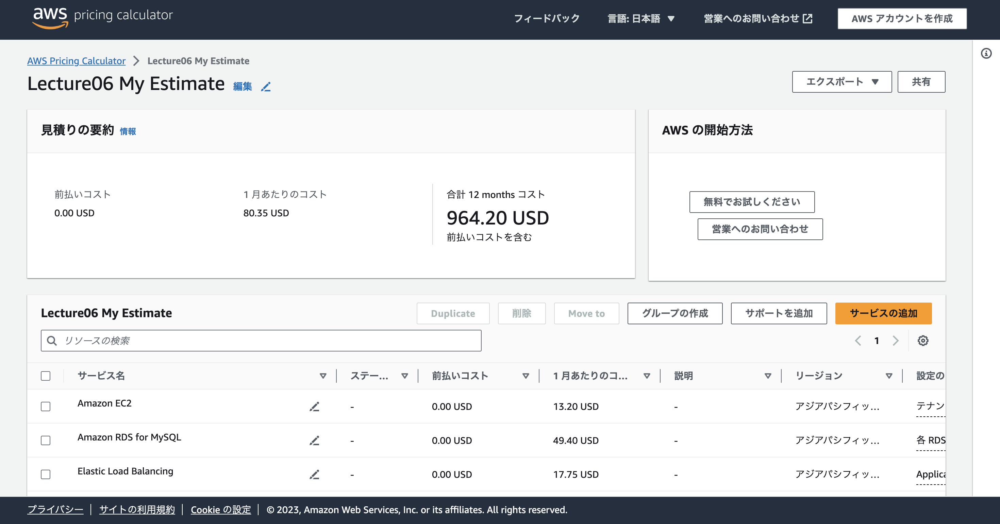
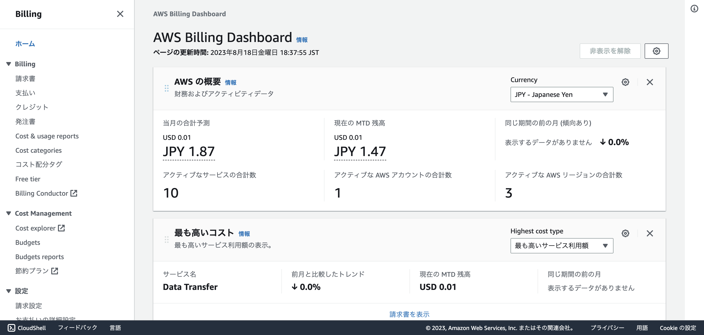
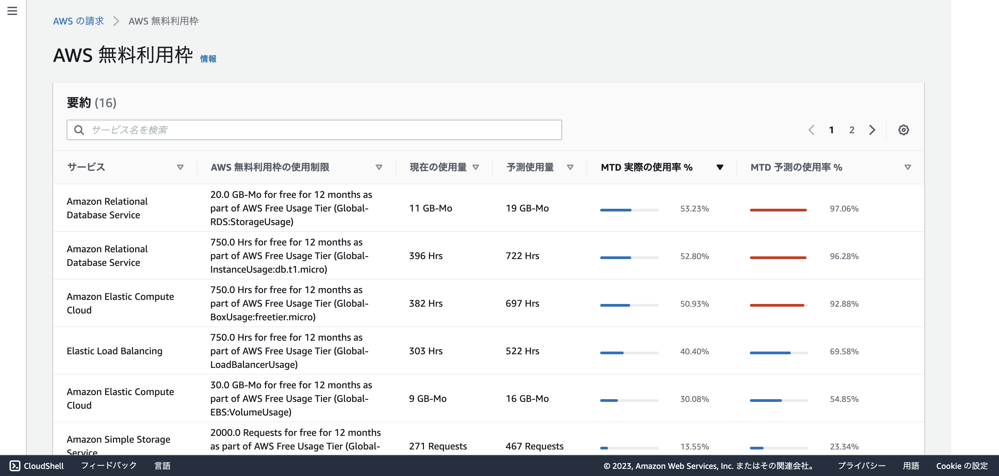

# AWS第6回講義課題

### ●AWSを利用した記録をCloudTrailで３つ探す(イベント名/内容)

### ●CloudWatchアラームを使ってALBのアラームの設定(AmazonSNSを使う)OKアクションの設定する　アプリケーションのサーバー(Rails)の停止や起動の動作をしてそれぞれどのような挙動になるか確認する

### ●今日まで作成したリソースで見積もりを作ってURLで共有する

### ●マネージメントコンソールの請求情報から現在の利用料の確認　無料使用枠に収まっているか

- AWSを利用した記録をCloudTrailで３つ探す(イベント名：内容)

`ConsoleLogin`：AWSのコンソールにログインしたこと

`CheckMfa`：MFA認証を行ったこと

`DeleteBucket`：AmazonS3のバケットを削除したこと

- CloudWatchアラームを使ってALBのアラームの設定(AmazonSNSを使う)OKアクションの設定する　アプリケーションのサーバー(Rails)の停止や起動の動作をしてそれぞれどのような挙動になるか確認する

CloudWatchのマネージメントコンソールで設定

[CloudWatch参考資料](https://it-ouji.com/2021/02/17/aws-cloudwatchでロードバランサーのターゲットがアンヘル/)

サーバー停止状態（Unhealthy）

アラーム設定とOKアクション設定（アラーム状態）

アラームメール受信

サーバー起動状態（Healthy）

アラーム設定とOKアクション設定（OK状態）

OKアクションメール受信

- 今日まで作成したリソースで見積もりを作ってURLで共有する

[見積り参考資料](https://www.techpit.jp/courses/119/curriculums/122/sections/908/parts/3480)

[AWS利用の見積もりURL](https://calculator.aws/#/estimate?id=5c13283f00ff087b0dd41d73b235d19df37e4b5d)

EC2,RDS,ELB(ALB)S3

`ロードバランサーキャパシティーユニット (LCU)` に関しては今回はほとんど消費しないので、 `処理されたバイト (EC2 インスタンスおよび IP アドレスのターゲットとして)` で `GB per 月` を選択し、 `1` を入力した。

概算を作成したら共有しないとURLが作成されない

- マネージメントコンソールの請求情報から現在の利用料の確認　無料使用枠に収まっているか

現在の利用料確認

無料利用枠を確認したら収まっていた

以上。

