# AWS第10回講義課題

### ●CloudFormationを利用して、現在までに作った環境をコード化しましょう。

### コード化ができたら実行してみて、環境が自動で作られることを確認してください。

VSCodeの拡張機能を使ってCloudFormationを実施させる

`.yml`の拡張子を付けることでテンプレートを作りCloudFormationに取り込むことができ、それぞれがスタックとなる

`start`と入力してCloudFormationの枠を作る

`AWSTemplateFormatVersion: 2010-09-09`と`Resoueces`以外を削除

`Resoueces`の内に`VPC`を作成

`InternetGateway`を作成

`AttachGateway`は自動で作成されるが`Properties`の入力に注意する！

`Subnet`を`Public`と`Private`を2つずつ作成`!Ref関数`を使用して先ほど作ったVPCを指定した

`RouteTable`を4つ作成

`RouteTaleAssociation`を4つ作成

`Route`を`PublicSubnet`の分だけ作成(2つ)

（`PubicSubnet`だけ`InternetGateWay`での通信が必要なため）

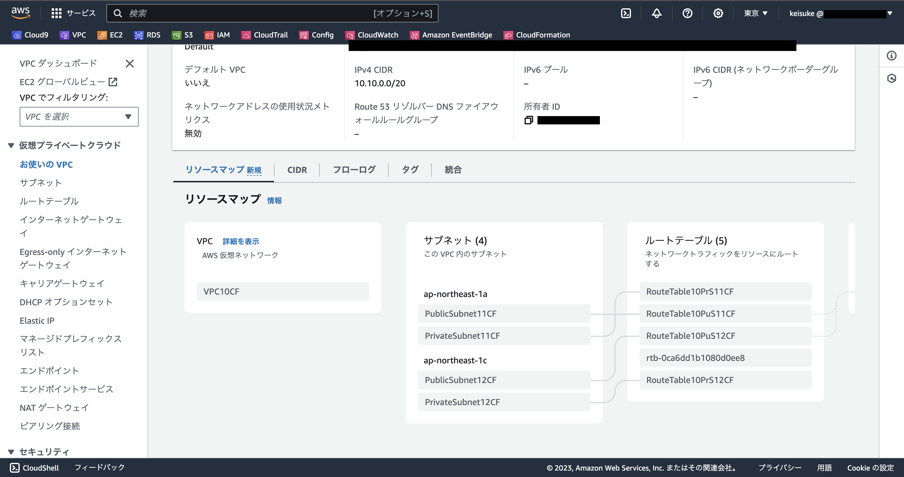

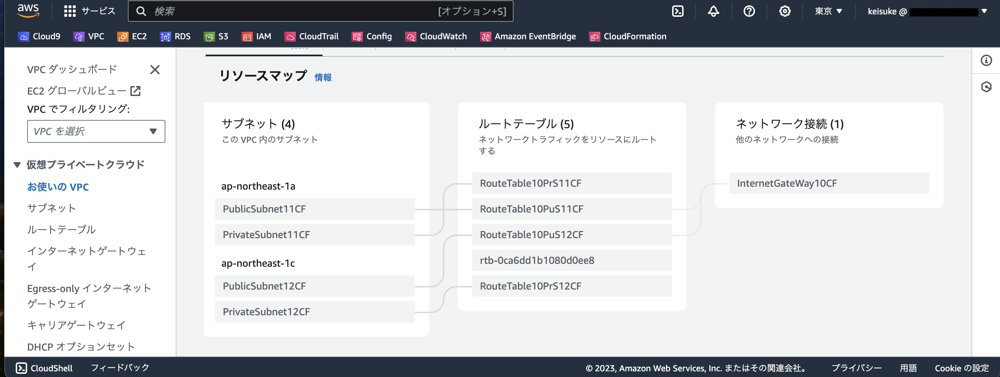

`SecurityGroup`を作成

`EC2`を作成

`EC2`の中に`NetworkInterfaces`を追加しないとパブリックIPが作成できないので注意する！

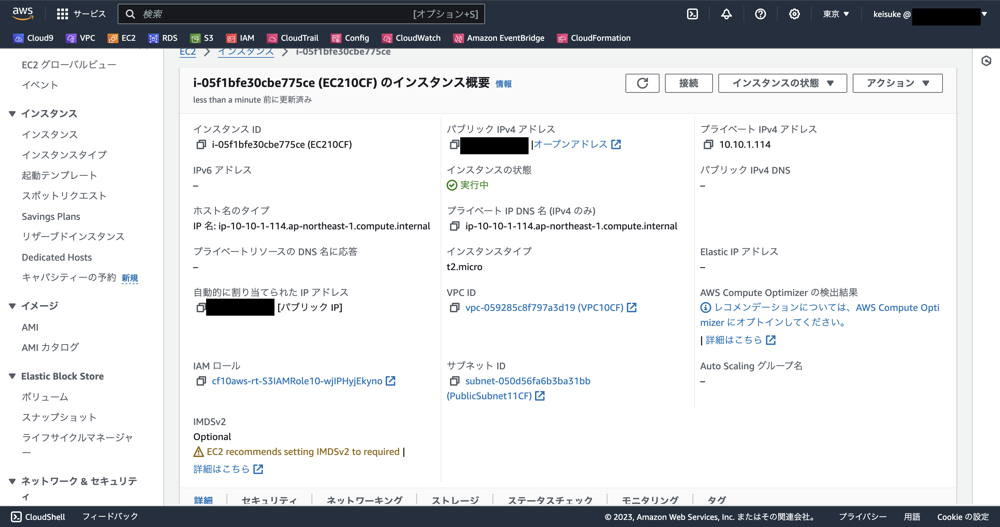

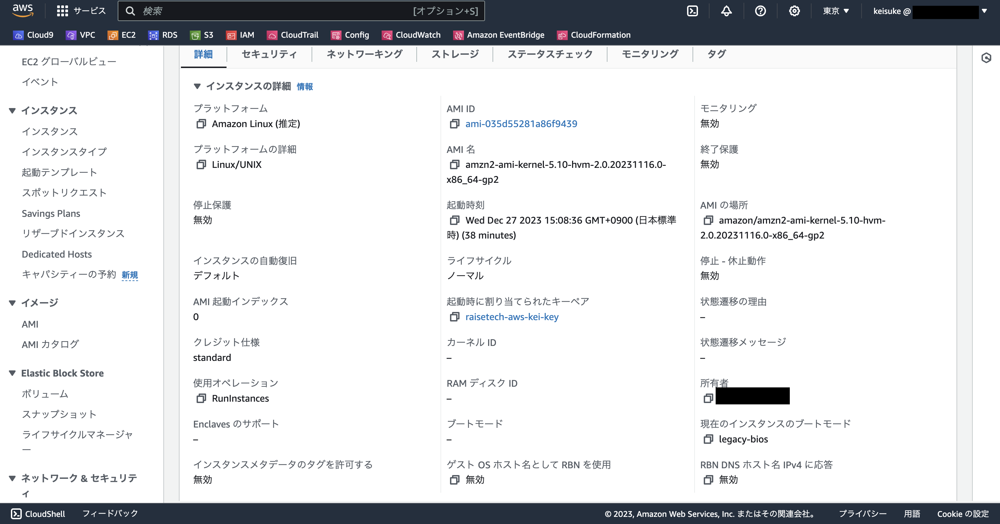

`RDS`を作成

`RDS`作成の前に最初に作った`PrivateSubnet`の２つ使って`RDSDBSubnetGroup`を作成

`RDS`の`SecurityGroup`を作成して`Ingress (インバウンドルール)`に`EC2`の`SecurityGroup`だけを追加した

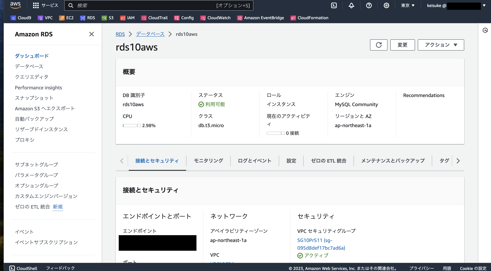

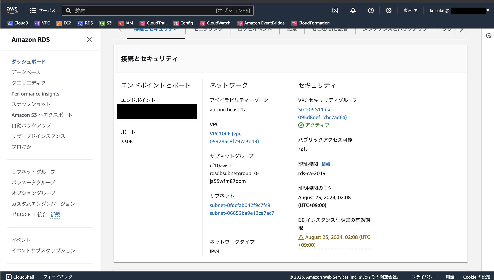

`RDS`追加分のテンプレートを`CloudFormation`で更新するとき`”Invalid template resource property 'Tags’”`というエラーが出て調べたら`RDSSubnetGroup`に`Tags`は無いということで削除したら更新することが出来た

※VSCodeの拡張機能で`CloudFormation`のテンプレートを作成しているが全てを信用しないでAWSのドキュメントと照らし合わせながら作成していく必要がある！

`EC2`にSSH接続して`RDS`に接続確認する

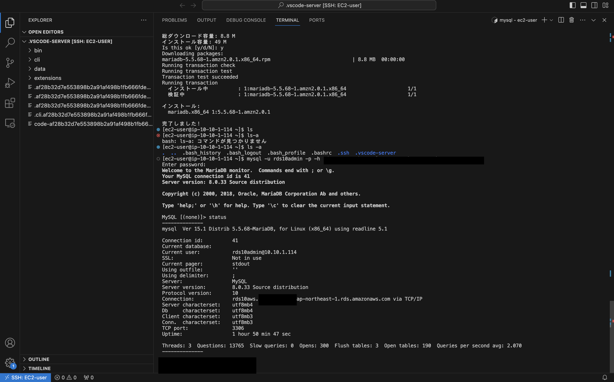

`ELB`を作成

`LoadBalancer,TargetGroup,Listener`をAWSのドキュメントを見ながら作成

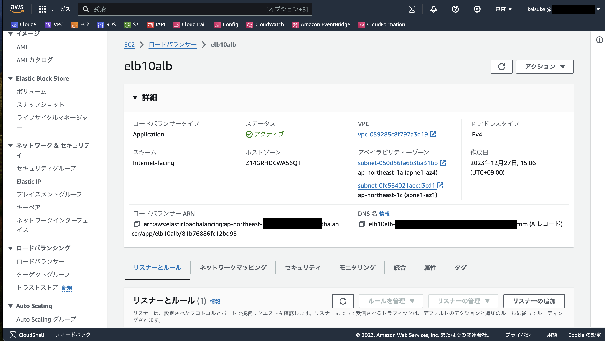

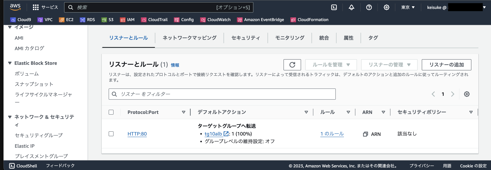

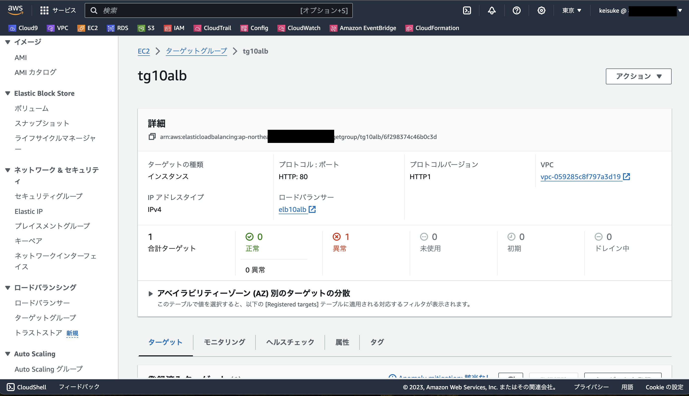

`S3`を作成

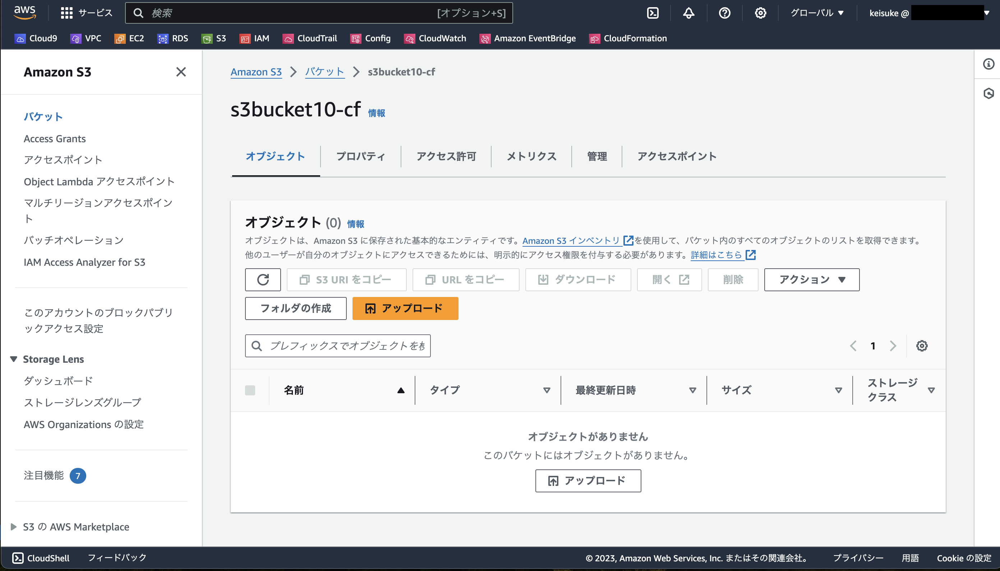

`IAM`の`Role,Policy,InstanceProfile`を作成

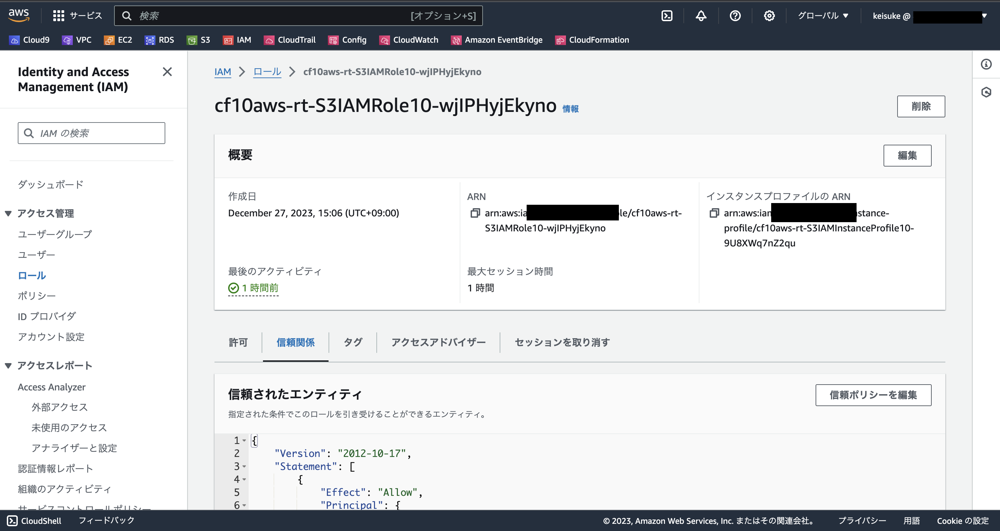

`EC2`の`Properties`に`IamInstanceProfile`を追加する

＜参考資料＞

- AWS公式ドキュメント(スニペット)

[AWS公式ドキュメント参考資料](https://docs.aws.amazon.com/ja_jp/AWSCloudFormation/latest/UserGuide/aws-template-resource-type-ref.html)

- VPC

[VPC参考資料1](https://dev.classmethod.jp/articles/cloudformation-beginner01/)

[VPC参考資料2](https://blog.serverworks.co.jp/build-vpc-and-pubsub-by-cfn)

[VPC参考資料3](https://zenn.dev/tmasuyama1114/articles/aws-cloudformation-basics)

- EC2

[EC2参考資料1](https://qiita.com/shonansurvivors/items/dc32e29fbb02cafdea17)

[EC2参考資料2](https://qiita.com/tyoshitake/items/c5176c0ef4de8d7cf5d8)

- RDS

[RDS参考資料1](https://qiita.com/kobayashi_0226/items/d0f49dbe84937de73a4d)

[RDS参考資料2](https://dev.classmethod.jp/articles/cloudformaion-aurora-dbinstance-not-use-property/)

- ELB

[ELB参考資料1](https://qiita.com/toyoyuto618/items/05bfb0ca2fbe14207274)

[ELB参考資料2](https://dev.classmethod.jp/articles/alb-cfn-template-to-study/)

[ELB参考資料3](https://cloud5.jp/cf-alb/)

[ELB参考資料4](https://dev.classmethod.jp/articles/nlb-accesslog-s3-cfn/)

- S3

[S3参考資料1](https://qiita.com/miyabiz/items/db97d1b719d99594e203)

[S3参考資料2](https://zenn.dev/part_of_mitsuo/articles/20220627-cloudformation01)

- IAM(role,policy,instanceprofile)

[IAM参考資料1](https://qiita.com/predora005/items/480dc3db258e84fcee81)

[IAM参考資料2](https://zenn.dev/yuta28/articles/ec2-iam-instance-profile)

以上。
