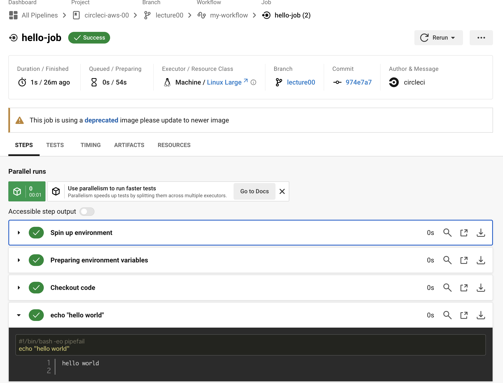
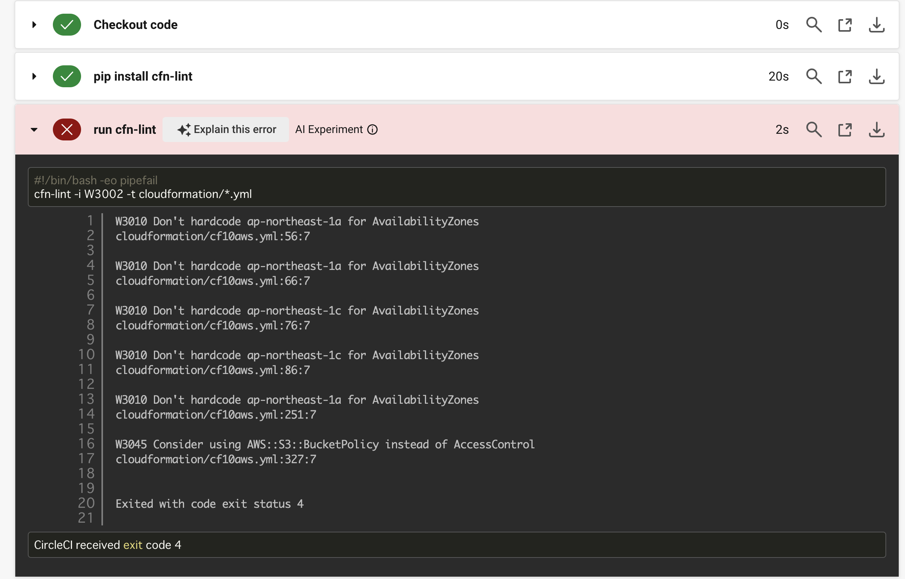
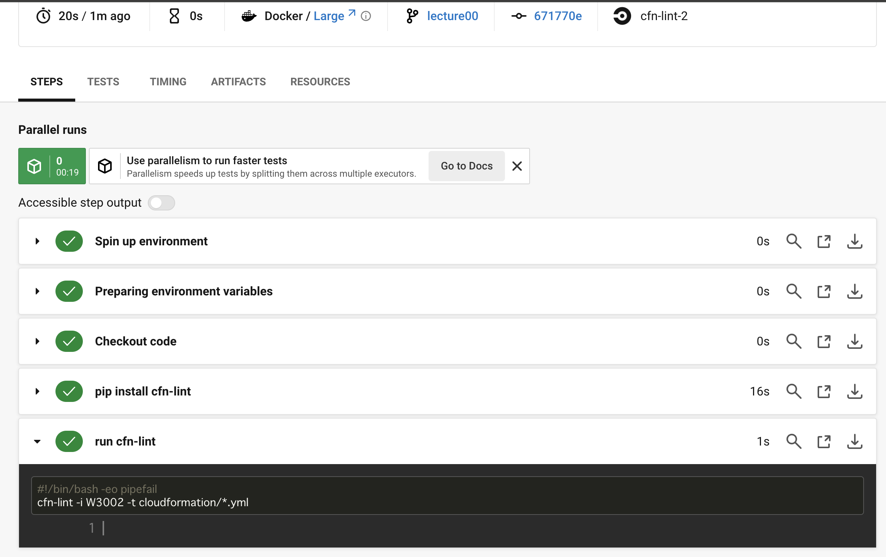

# AWS第12講義課題

## ●CircleCI のサンプルコンフィグを使って、正しく動作するようにリポジトリに組み込む。

CircleCIを使ってCloudFormationで作ったテンプレートをチェックする

[CircleCI参考資料1](https://circleci.com/docs/ja/github-integration/#connect-a-github-account)

[CircleCI参考資料2](https://docs.github.com/en/authentication/connecting-to-github-with-ssh/managing-deploy-keys#set-up-deploy-keys)

[CircleCI参考資料3](https://zenn.dev/jnxjez/articles/aa4b441571ef91)

## CircleCIへ登録

CircleCIへの登録はメールアドレスとパスワードだけで出来るが、そこからGitHub等と連携させるにはSSH秘密鍵が必要になる（SSH キーを使用して GitHub への認証を行い、コードをチェックアウト）

- 端末で SSH キー ペアを生成（localpc）

% `ssh-keygen -t ed25519 -f ~/.ssh/project_key -C email@example.com`

※`email@example.com`の部分はGitHubに登録しているメールアドレスが望ましい

パスフレーズは空のままで良いため、Enterを2回押す

- SSH 公開キーをコピーしGitHubのデプロイキーとしてリポジトリに追加

% `pbcopy < ~/.ssh/project_key.pub`

※上記のコマンドで`project_key.pub`をコピーできているので、GitHubのSettingsのDeploy keysでデプロイキーの追加をする。適切なTitleを入力して先ほどコピーできている`project_key.pub`をKeyの部分に貼り付ける。書き込みアクセスを許可するかのチェック項目があるがデプロイキーは通常、リポジトリへの読み取り専用アクセスを提供するために使用する。デプロイキーにはデプロイ時の安全なアクセスを確保する役割がある。悪意のある攻撃者がデプロイキーを利用して意図せずにコードを変更する可能性がある。デプロイキーには書き込み権限（プッシュ権限）を設定しないことがセキュリティの観点から推奨される。

- SSH 秘密キーをコピーし、下部にある空欄にの貼り付ける

% `pbcopy < ~/.ssh/project_key`

※上記のコマンドでコピーをした`project_key`を下部にある空欄に貼り付ける。

- 連携するリポジトリを選んでプロジェクトの作成

## CircleCIのインストール

[CircleCIインストール参考資料](https://circleci.com/docs/ja/local-cli/)

- 権限がなかったのでsudoコマンド

% `curl -fLSs https://raw.githubusercontent.com/CircleCI-Public/circleci-cli/master/install.sh | sudo bash`

## CLIの更新

- 更新を手動で確認する

% `circleci update check`

- CLI の最新バージョンに更新（Linux および Windowsインストールの場合）

% `circleci update`

## CLIを設定する

- Personal API Tokensを作成する

[Personal API Tokens](https://circleci.com/docs/managing-api-tokens/)

- コマンドを実行して CLI を設定

% `circleci setup`

## Hello Worldを表示させる

[config参考資料](https://circleci.com/docs/ja/config-intro/)

[Hello World参考資料](https://circleci.com/docs/ja/hello-world/)

- `.circleci`ディレクトリに`config.yml`ファイルを作成して下部の内容を入力

```yaml
version: 2.1

jobs:
  hello-job:
    machine:
      image: ubuntu-2204:2022.07.1
    steps:
      - checkout # check out the code in the project directory
      - run: echo "hello world" # run the `echo` command

workflows:
  my-workflow:
    jobs:
      - hello-job
```

- gitにadd,commit,pushする

- CircleCIのProjectsページの最新のトリガーイベントを選択

- `hello-job`までクリックし`echo "hello world"`ステップを選択すると`hello world`がコンソールに表示される



### `cfn-lint`がcloudformationディレクトリ内のymlファイルをチェックする

- config.ymlを書き換える

```yaml
version: 2.1
orbs:
  python: circleci/python@2.0.3
jobs:
  cfn-lint:
    executor: python/default
    steps:
      - checkout
      - run: pip install cfn-lint
      - run:
          name: run cfn-lint
          command: |
            cfn-lint -i W3002 -t cloudformation/*.yml

workflows:
  raisetech:
    jobs:
      - cfn-lint
```

- gitにadd,commit,pushする

- CircleCIのProjectsページの最新のトリガーイベントを選択してチェック結果を確認する

### cloudformationのymlファイルを確認後のerror対応



- エラーメッセージ↓

`W3010 Don't hardcode ap-northeast-1a for AvailabilityZones`

AvailabilityZonesをハードコーディングするのはセキュリティ的に問題がある

[cfn-lint参考資料](https://dev.classmethod.jp/articles/cfn-availavility-zone-notation/)

[AWS公式ドキュメント参考資料](https://docs.aws.amazon.com/ja_jp/AWSCloudFormation/latest/UserGuide/intrinsic-function-reference-getavailabilityzones.html)

- エラー対応↓

```yaml
AvailabilityZone: ap-northeast-1a # <= Warning!
↓
AvailabilityZone: !Select         #
        - 0                             # => ap-northeast-1a
        - Fn::GetAZs: !Ref AWS::Region  #
```

```yaml
AvailabilityZone: ap-northeast-1c # <= Warning!
↓
AvailabilityZone: !Select         #
        - 1                             # => ap-northeast-1c
        - Fn::GetAZs: !Ref AWS::Region  #
```

- エラーメッセージ↓

`W3045 Consider using AWS::S3::BucketPolicy instead of AccessControl`

AccessControlをハードコーディングするのはセキュリティ的に問題がある

[AWS公式ドキュメント参考資料1](https://docs.aws.amazon.com/AWSCloudFormation/latest/UserGuide/aws-resource-s3-bucket.html#cfn-s3-bucket-accesscontrol)

[AWS公式ドキュメント参考資料2](https://docs.aws.amazon.com/AWSCloudFormation/latest/UserGuide/aws-resource-s3-bucketpolicy.html)

- エラー対応↓

```yaml
# S3,create
  S3Bucket10:
    Type: AWS::S3::Bucket
    Properties:
      AccessControl: Private      #削除
      BucketName: s3bucket10-cf
      Tags:
        - Key: Name
          Value: S3Bucket10Cf
↓
# S3,create
  S3Bucket10:
    Type: AWS::S3::Bucket
    Properties: 
      BucketName: s3bucket10-cf
      Tags:
        - Key: Name
          Value: S3Bucket10Cf
```

- gitにadd,commit,push完了



※CloudFormationに通したら、追加したBucketPolicyのところでエラーが出ていたみたいで、削除したらエラーは解除された。

以上。