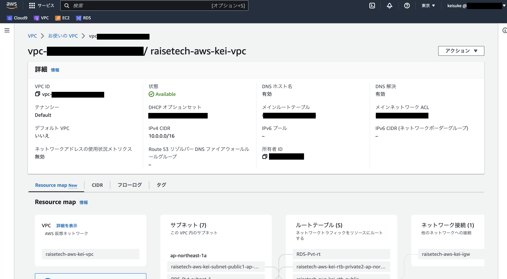
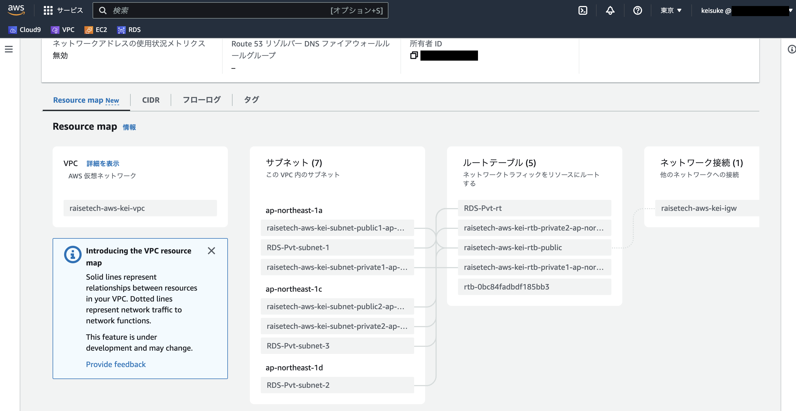
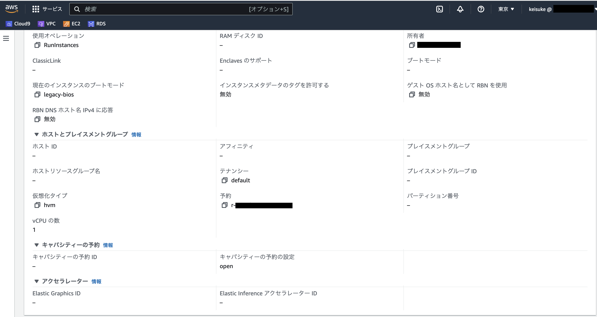
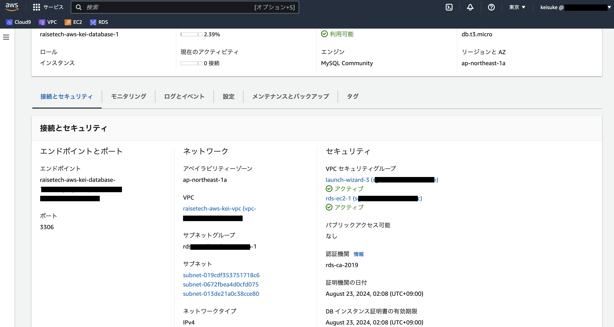
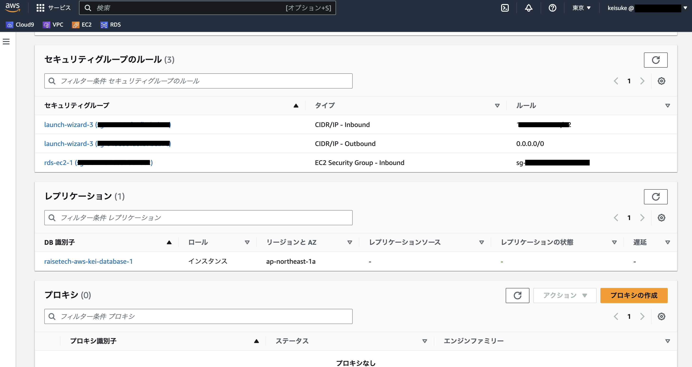
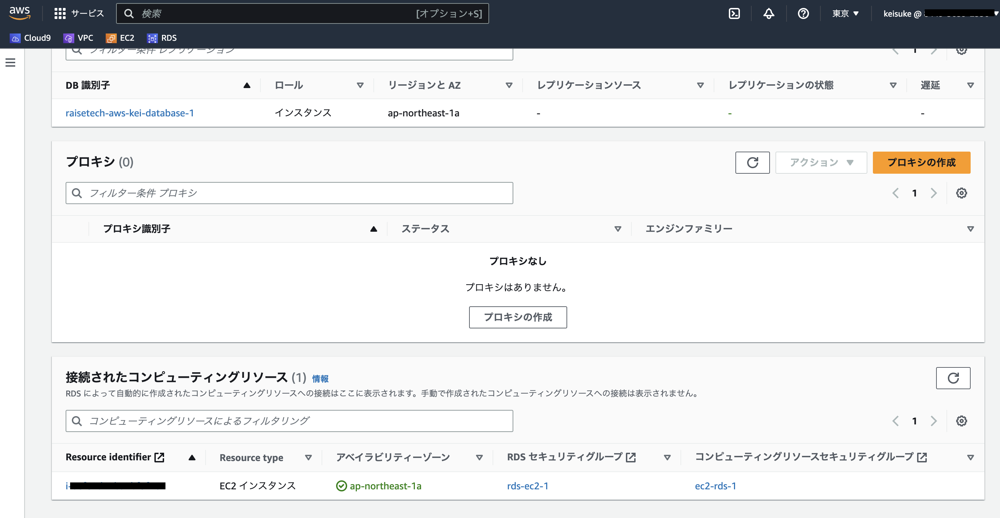
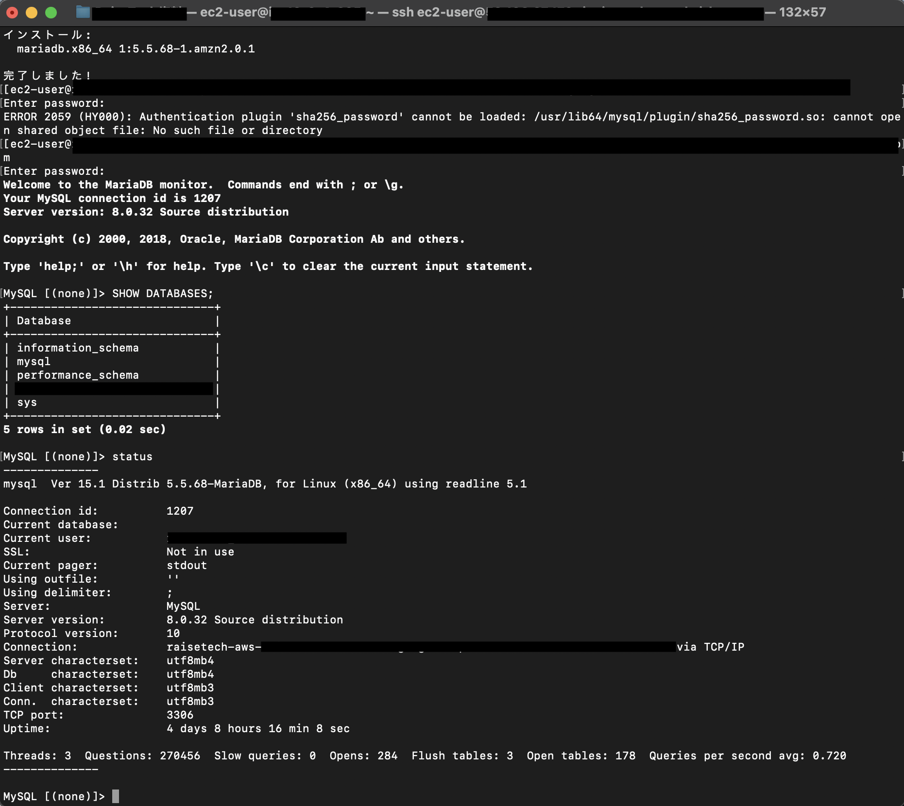

##AWS第４回講義課題

###VPC設定

###EC2設定

###RDS設定

###EC2からRDSへ接続

###今回の課題で学んだこと

chmod 600 〈キーペア〉：セキュリティレベルを上げるため

ssh 〈ユーザー名〉@〈EC2パブリックIP〉 -i 〈キーペア〉：ターミナルでEC2に接続

sudo yum update：アップデートが必要だったため

ping 〈RDSエンドポイント〉：接続できているか確認したかったがchatGPTによるとあまり意味がないとのこと

sudo yum install mysql：mysqlがインストールされていなかったため

mysql -u 〈マスターユーザー名〉 -p -h 〈RDSエンドポイント〉：RDSインスタンスに接続

SHOW DATABASES：データベース一覧の表示（mysql内コマンド）

status:ステータス表示（mysql内コマンド）

